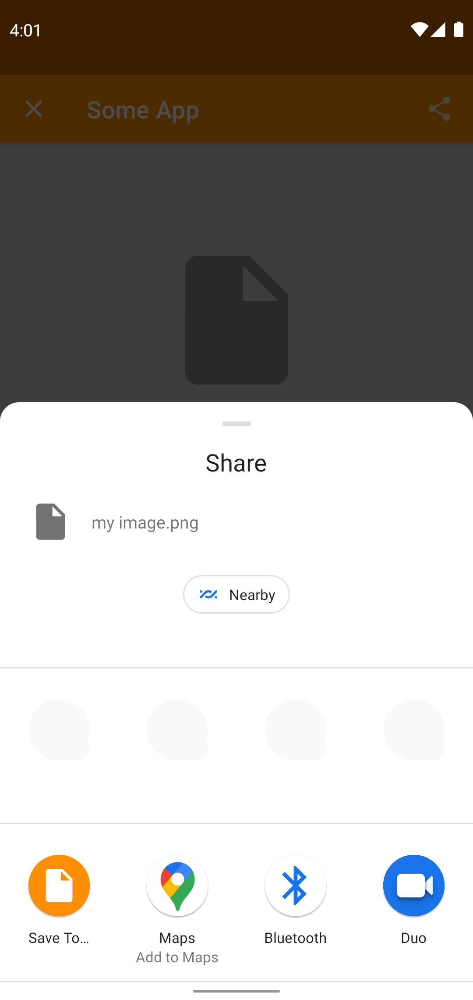
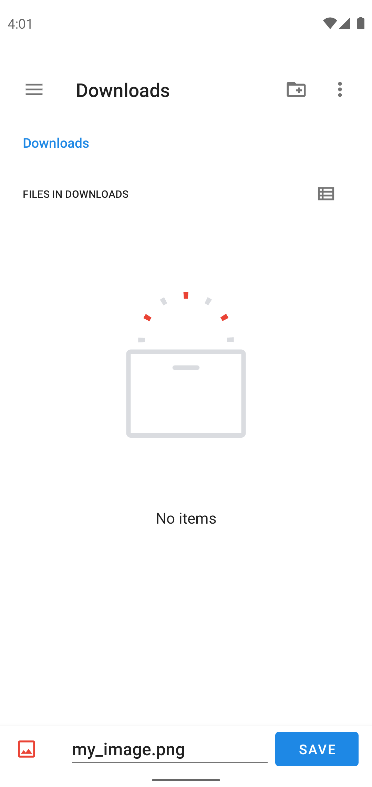

<div align="center">

  
  <h1>Save To…</h1>
  
  <p>
    Android App to save shares from any app into a file.
  </p>
   
  <h4>
      <a href="https://play.google.com/store/apps/details?id=at.xa1.safeto">Download</a>
    <span> · </span>
      <a href="https://xa1.at/saveto/">Website</a>
    <span>
    <span> · </span>
      <a href="mailto:support@xa1.at?subject=Save%20To%20App">Contact</a>
  </h4>
</div>

<!-- About the Project -->
## About the Project

Exporting data from any app into a file made simple.
Just open the share options, select "Save To…" and choose the target file.
Done.
No permissions required.

<div align="center"> 
  
  
  
</div>

More infos on the official website: [xa1.at/saveto](https://xa1.at/saveto/).

Background on blog post: [I Published My First App on the Google Play Store](https://xa1.at/first-app-published/)

<!-- Generated using: https://play.google.com/intl/en_us/badges/ -->
<a href="https://play.google.com/store/apps/details?id=at.xa1.safeto"></a>

<!-- TechStack -->
### Tech Stack

Native Android App.

Maximum Privacy. No Permissions required. Not even internet access.

<!-- Features -->
### Features

- Introduction Guide
- Open from Share Dialog and save shared item into a file.
- Settings

<!-- Color Reference -->
### Color Reference

| Color | Hex |
| --- | --- |
| Primary Color |  #ff8f00 |

<!-- Getting Started -->
## Getting Started

<!-- Prerequisites -->
### Prerequisites

- Android Studio
- Java 17+
- sh

### Code Checks

Before committing run:
```bash
./debugCheck.sh
```

This compiles the code, runs ktlint, unit tests and android tests.

### Package-Structure

- `at.xa1.saveto`: main package with the most fundamental classes (like `MainActivity` and `MainCoordinator`)
  - `common`: generic, non-app-specific classes
    - `android`: generic, non-app-specific classes that are strongly related to Android.
  - `di`: Dependency Injection.
  - `feature`: sub packages contain pieces of functionality, that don't depend on other features.
  - `ui`: User interface components that are not feature specific.


## Release

_This is only relevant for the deployer._

1. Update `versionCode` and `versionName` in `app/build.gradle.kts`
2. Run:
   ```bash
   ./release.sh
   ```
3. Upload `app/build/outputs/bundle/release/app-release.aab` to Google Play Console.

### Signing

Signing is located in `.signing` folder.
It is added to `.gitignore` to avoid accidental committing.
Extract `release.jks` (and `private_key.pepk`) from Password Manager to `.signing`.

Create `.signing/keystore.properties`:
```properties
keyAlias=releaseKey
keyPassword=[PASSWORD FROM PASSWORD MANAGER]
storeFile=.signing/release.jks
storePassword=[SAME PASSWORD FROM PASSWORD MANAGER]
```

### Create Screenshots

* Start Emulator.
* Make sure status bar is empty.
* Make sure battery, network and wifi are full (emulator settings).
* Use gesture navigation to hide navigation buttons (android settings).
* Set time to: 04:01  (android settings).
* Use tests in `PlayStoreScreenshots` for individual screens:
  * Clear screenshot folder on emulator:
    ```sh
    adb shell rm -rf "/storage/emulated/0/Pictures/screenshots"
    ```
  * Run [`PlayStoreScreenshots` tests](app/src/androidTest/java/at/xa1/saveto/screenshot/PlayStoreScreenshots.kt)
  * Download screenshots from emulator:
    ```sh
    adb pull "/storage/emulated/0/Pictures/screenshots"
    ```

## Roadmap

- [x] Return OK Result when finished successfully
- [x] Show KB copied
- [x] Show Success
- [x] Show Error
- [x] Propose Filename
- [x] Support Plain Text
- [x] Make Scrollable
- [x] Dependency Injection
- [x] List open source licenses
- [x] Settings
- [x] Intro
- [x] Screenshots
- [x] Feature graphic
- [x] https://xa1.at/saveto/ site
- [x] Review package and file structure
- [x] Show version in settings
- [x] Create screenshots using [Screenshot.capture()](https://developer.android.com/reference/androidx/test/runner/screenshot/Screenshot#capture()) instead of doing it manually.
- [x] Filename Templates
- [ ] CI setup
- [ ] Bug: Shouldn't be possible to open from recents.
- [ ] Abort (back button)
- [ ] Support multiple files shared at once.

## License

Distributed under [BSD 3-Clause License](LICENSE). See [LICENSE](LICENSE) for more information.

## Contact

- Twitter: [@xa17d](https://twitter.com/xa17d)
- Website: [xa1.at/saveto](https://xa1.at/saveto/)
- E-Mail: [support@xa1.at](mailto:support@xa1.at?subject=Save%20To%20App)

## Attributions

README inspired by [Louis3797/awesome-readme-template](https://github.com/Louis3797/awesome-readme-template).

Google Play and the Google Play logo are trademarks of Google LLC.
